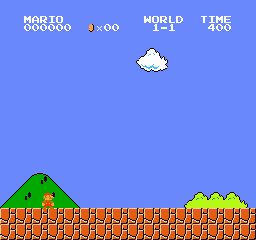

# [PYTORCH] Reinforcement Learning-Super Mario Bros Using MLP policy

This is the second attempt to crack the game of super mario bros. Earlier i hace already tried using CNNpolicy. But the Agent was not able to complete the level and the training time was largely high<br>
<br>
So i decide to take a new crack at the problem<br>

Older Project: [`Repo Link`](https://github.com/harikris001/Super-Mario-Reinforcement_Learning)

## Packages Used:
* gym-super-mario-Bros == 7.3.0
* gym == 0.21.0
* ipykernal
* Stable-Baselines3
* Pytorch 1.13

## Setting Up Pytorch
_I would recoomend you to check official Pytorch website to install it_<br>
**The Pytorch need the exact version of Cuda to work normally**<br>
Pytorch website: [`pytorch`](https://pytorch.org/get-started/locally/)

## Creating Virtual Environment:
setting up a virtual environment will really help in Creating a seperatiion wwithin your workspace and PC<br>
**Run following to create a virtual environment**
* launch cmd 
* move to your desired directory
* Run the following:
```python -m venv ppo```
activate your virtual env using following:<br>
```.\ppo\Scripts\activate```<br>
to deactivte just type _deactivate_ in cmd

### Installing all libraries
To install all the libraries that are necessary for the projet in your cmd after activating environment run the command<br>
```pip install -r requirments.txt```<br>


## Creating a New kernel in Jupyter Notebook
After installing Ipykernal run the following:<br>
```python -m ipykernel install --user --name=ppo```<br>
##### _note: the name of kernel should be same as venv name_


## Training the Agent
Either clone my repo or download the zip or copy paste the code and run them<br>
Github clone Link: https://github.com/harikris001/Super-mario-Reinforcement-Learning-V2.git <br>
Run the cells and wait for it to complete.


## After Training:
The training time was largely reduced comparing the previous project <br>
the agent was also able to complete the level<br>
Level 1 Output:<br>
**OUTPUT:**    <br>
**Steps**  8M<br>
**Completed**  True


**I have attached the Pre trained models if u want to test them**<br>
**Some other Models are also Attached but they have not completed the levels**